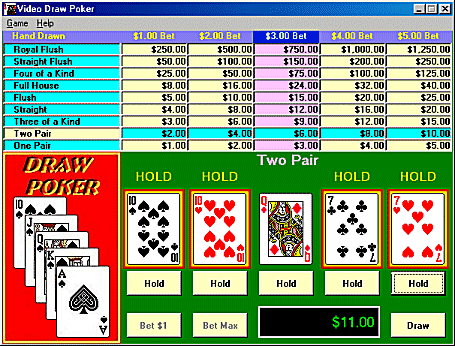



## Video Draw Poker

### Description

A completed application. Code is released by rd-soft.com to demonstrate how to develop a draw poker game. All rules of the game are included in the code, including the ranking of the hands. Deck of cards are shuffled after the completion of each play. Hold and discard cards. This code requires the VBCards.ocx, which I found here at PSC. If you find this code of use, please vote (every vote counts).

File updated to include the help file and about dialog box.
 
### More Info
 
Requires VBCards.OCX. Released for demonstrative purposes only.

None... bug free!

             |
---                |---
**Submitted On**   |2001-03-28 20:11:44
**By**             |[Roy Pope](https://github.com/Planet-Source-Code/PSCIndex/blob/master/ByAuthor/roy-pope.md)
**Level**          |Beginner
**User Rating**    |5.0 (40 globes from 8 users)
**Compatibility**  |VB 6\.0
**Category**       |[Games](https://github.com/Planet-Source-Code/PSCIndex/blob/master/ByCategory/games__1-38.md)
**World**          |[Visual Basic](https://github.com/Planet-Source-Code/PSCIndex/blob/master/ByWorld/visual-basic.md)
**Archive File**   |[CODE\_UPLOAD176753282001\.zip](https://github.com/Planet-Source-Code/roy-pope-video-draw-poker__1-21990/archive/master.zip)

